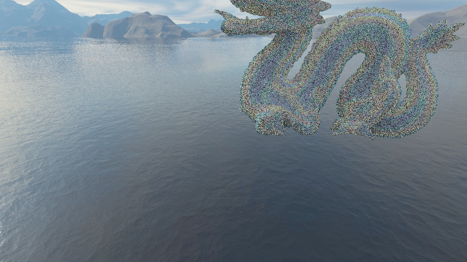
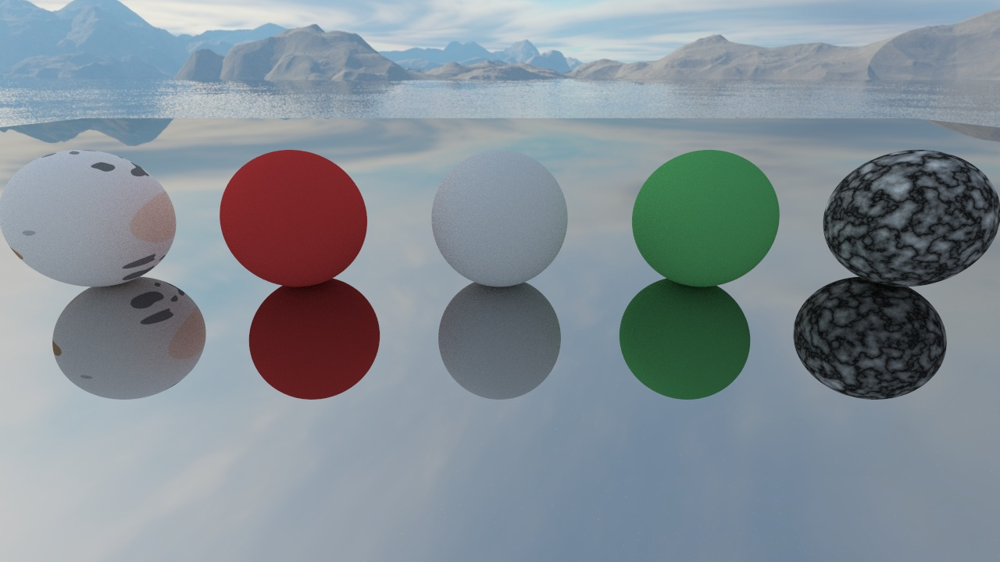
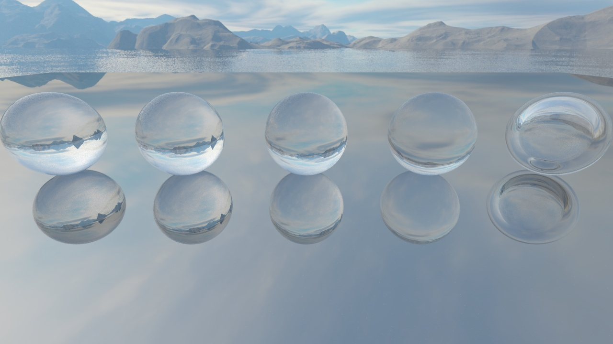
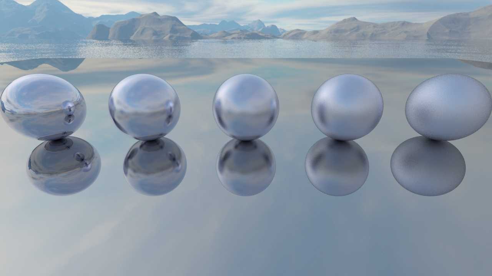
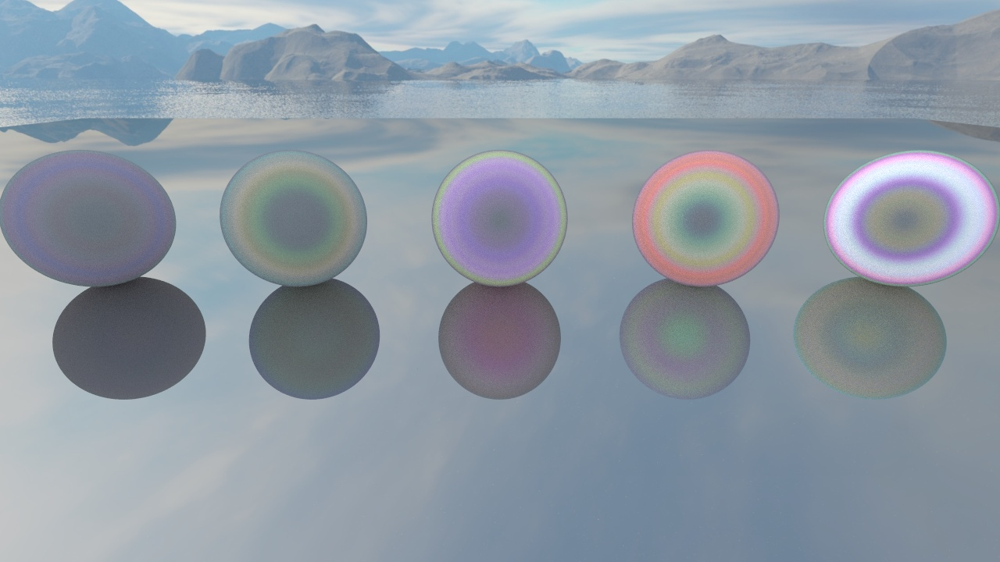
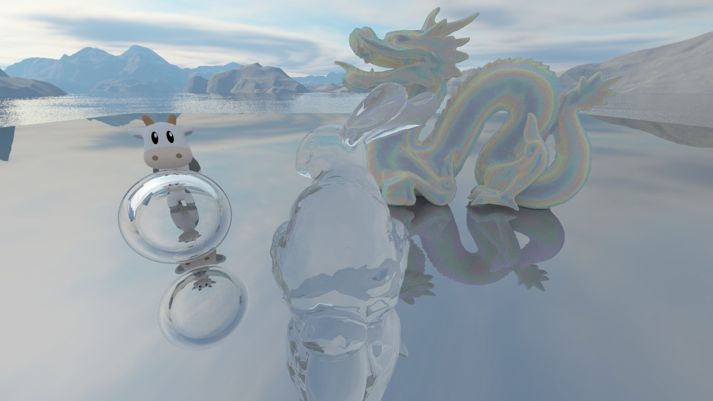
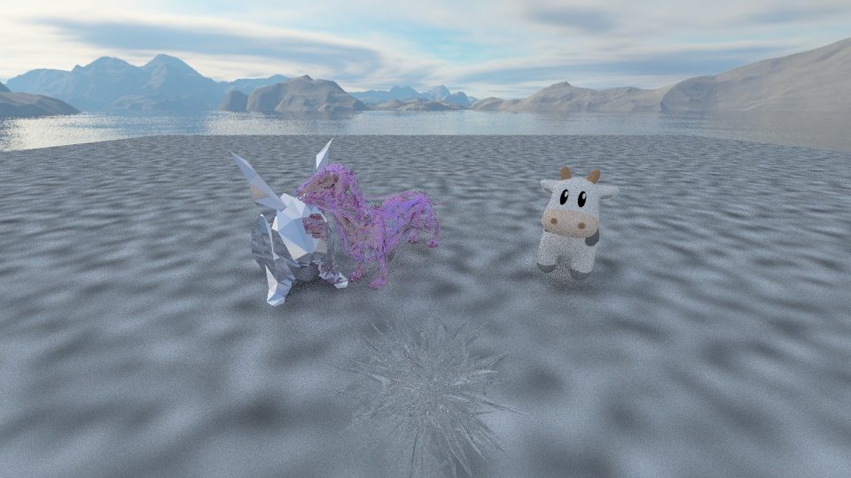
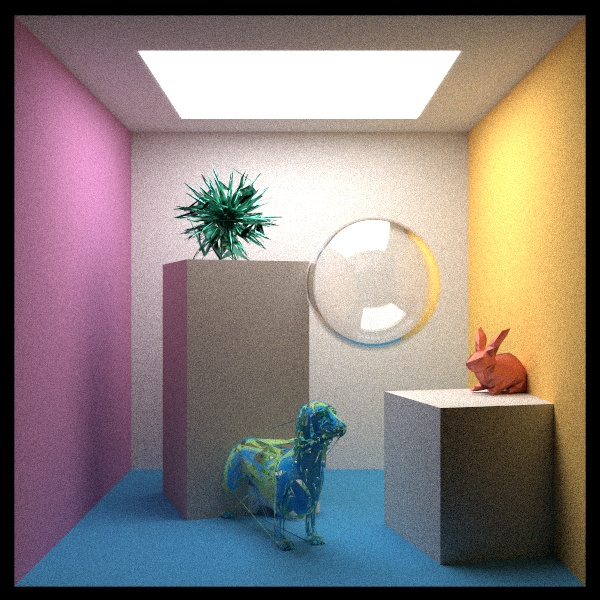

# MY TOY RAY TRACER

# BUILD

Supported platforms:

* Linux

Requirements:

* OpenCV

* OpenMP

building steps:

    cd $ROOT_PATH$
    mkdir release && cd release
    cmake -DCMAKE_BUILD_TYPE=Release ..
    make

# RUN

    ./toy_ray_tracer -s $SCENE_IND -p $SAMPLES_PER_PIXEL$
    ./toy_ray_tracer -s 1 -p 1

# SCENE INDEX

1. 反射，玻璃，龙等模型
2. 棋盘格，一些模型
3. 修改过的Cornell Box
4. Perlin地面贴图，龙等模型
5. Lambertian材质球
6. Dielectric材质球
7. Metal材质球
8. BRDF材质球
9. Perlin材质球
10. 使用BVH
11. 不使用BVH

# TEST ENVIRONMENT

CPU: i7-9850H

内存: 32G

显卡: T2000

系统：Ubuntu18.04LTS

# TEST RESULTS

SCENE:

Image size: 960 * 540

Model size: 15000 triangles

Samples per pixel: 1

With BVH CPU Cost time: 4.850s

Without BVH CPU Cost time: 158.687s

# OTHER RESULTS

